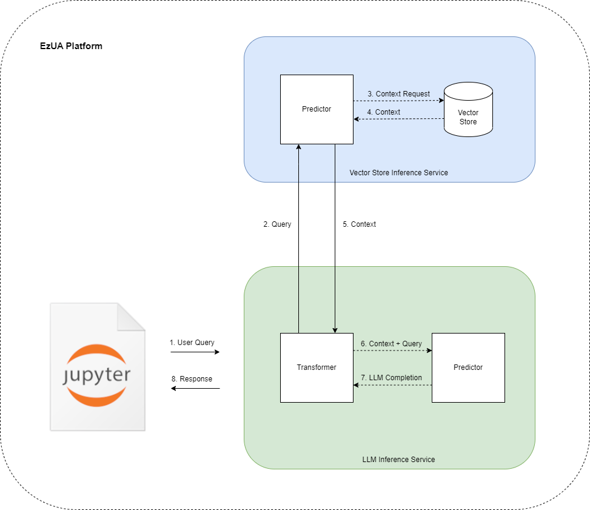

# Question Answering

This project utilizes an open-source Large Language Model (LLM) that is capable of answering questions over a corpus of private documentation. To achieve this, the experiment employs a Vector Store that captures and indexes a latent representation for each document. This allows the application to retrieve the relevant context based on the user's questions, enabling accurate and efficient question answering.


> Photo by <a href="https://unsplash.com/@anniespratt?utm_source=unsplash&utm_medium=referral&utm_content=creditCopyText">Annie Spratt</a> on <a href="https://unsplash.com/photos/5cFwQ-WMcJU?utm_source=unsplash&utm_medium=referral&utm_content=creditCopyText">Unsplash</a>
  

## What You'll Need

To complete the tutorial follow the steps below:

- Login to you EzAF cluster.
- Create a new notebook server using the `jupyter-data-science` image.
- Clone the repository locally.
- Create a new conda environment using the specified `environment.yaml` file:
  ```
  conda env create -f environment.yaml
  ```
- Launch the five Notebooks in order and execute the code cells.

> See the "Usage" section below for the steps you need to run before executing the Notebooks

## How It Works

This project utilizes a [HuggingFace embedding model](https://huggingface.co/sentence-transformers/all-MiniLM-L6-v2) to map the sentences and paragraphs of a corpus of private documents to a `384`-dimensional dense vector space. This enables the use of advanced techniques like semantic search, which can help users find relevant information quickly and accurately. The resulting vectors are stored and indexed in [Chroma](https://www.trychroma.com/), an AI-native, open-source embedding database.

Once a question is provided, the application embeds it into the same vector space using the same transformer model. It then retrieves the `4` most relevant documents by applying a certrain algorithm (by default kNN). Finally, the application passes the user's question and the retrieved context to an LLM, which can answer the question in a human-like way. By leveraging advanced techniques like vector embeddings and machine learning, the application provides a powerful and intuitive way to search and analyze private documents.

## Usage

KServe allows you to create an inference service using a custom predictor. Since there's no out-of-the-box support for LLMs yet, you need to create the images that KServe will use to serve the Vector Store and the LLM. As such, you need to create three images:

1. Vector Store: Move into the `vectorstore` directory and build the Docker image using the provided Dockerfile.
1. LLM Transformer: Move into the `transformer` directory and build the Docker image using the provided Dockerfile.
1. LLM Model: Move into the `llm` directory and build the Docker image using the provided Dockerfile.

> For your convenience, you can use the pre-built images we have prepared for you:
> - Vector Store: `gcr.io/mapr-252711/ezua-demos/vectorstore:1.1`
> - LLM Predictor: `gcr.io/mapr-252711/ezua-demos/llm-predictor:1.0`
> - LLM Trasnformer: `gcr.io/mapr-252711/ezua-demos/llm-transformer:1.0`

Once the images are ready, proceed to run the Notebooks. The project consists of four Notebooks. Launch and run each Notebook to explore and execute the experiment end-to-end:

1. `01.create-vectorstore`: Load the documents from your private corpus (e.g., the `documents` folder), process them, and create the Vector Store.
1. `02.serve-vectorstore`: Create an inference service for the Vector Store.
1. `03.document-precition`: (optional): Invoke the Vector Store inference service.
1. `04.serve-llm`: Create an inference service for the LLM.
1. `05.question-answering`: Invoke the LLM. Post a question to the LLM inference service and get back a human-like answer.

The last Notebook outlines the user's perspective. The application flow is depicted in the following figure:



1. User: Create a new request to the LLM inference service with a query.
1. LLM Transformer: Intercept the request, extract the user's query, and create a new request to the Vector Store inference service passing the user's question in the payload.
1. Vector Store: Accept the request from the LLM Transformer extract the user's question and based on the user's question retrieve the `4` most relevant documents.
1. Vector Store: Respond to the LLM Transformer.
1. LLM Transformer: Get the `4` most relevant documents from the Vector Store response.
1. LLM Transformer: Create a new request to the LLM Predictor passing the `4` most relevant documents as context and the user's question.
1. LLM Predictor: Accept the request from the LLM Transformer, extract the user's question as well as the context, and answer the user's question based on the relevant context.
1. LLM Predictor: Respond to the LLM Transformer with the completion prediction.